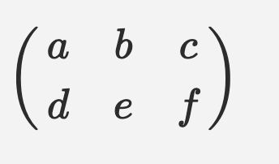

# vuepress-plugin-mathjax-bug8

## A simple equation

```
f(x, y, z)=x^{yz}+z^y+\lambda^\alpha
```

$$f(x, y, z)=x^{yz}+z^y+\lambda^\alpha$$

## frac

```
\left(\frac{x+y}{z}\right)
```

$$\left(\frac{x+y}{z}\right)$$

## matrix

This does not work.

```
$$\begin{pmatrix}a&b&c\\d&e&f\end{pmatrix}$$
```

$$\begin{pmatrix}a&b&c\\d&e&f\end{pmatrix}$$

### expected



### actual


